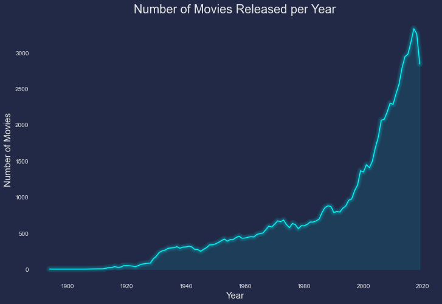
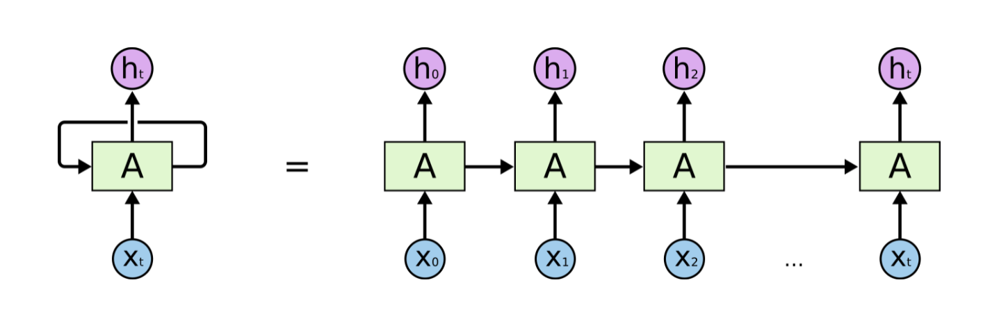
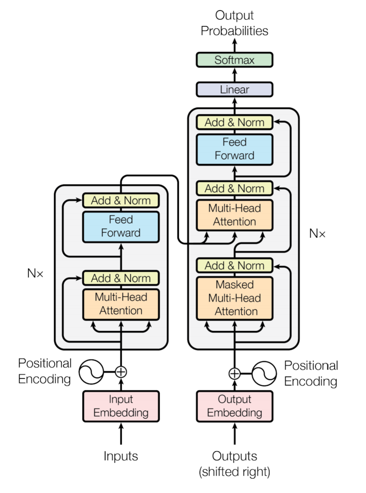
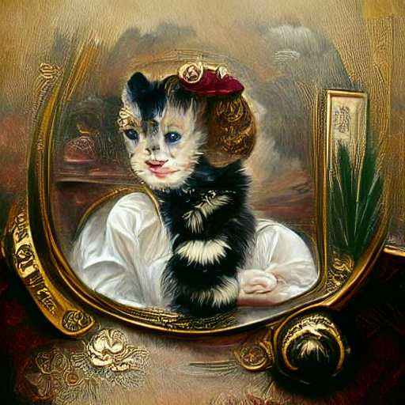
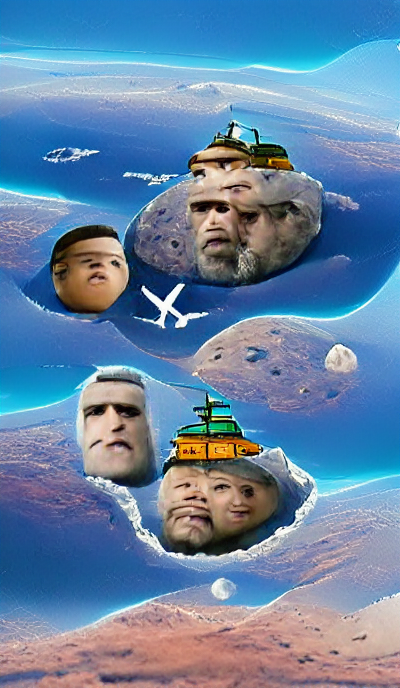

    

## Table of Contents

* [Introduction](#introduction)
* [Background](#background)
* [Data Analysis](#data-analysis)
  * [Movie Data](#movie-data)
  * [Feature Extraction](#feature-extraction)
* [Text Generation Models](#text-generation-models)
  * [RNN Model](#rnn-model)
  * [GPT-2 Transformer Model](#gpt-2-transformer-model)
* [Twitter Bot](#twitter-bot)
  * [Automation](#automation)
* [Next Steps](#next-steps)

# Introduction
This project uses data from IMBb which contains 85,000 movies. To generate movie plots, the `descriptions` field was used as training data and fed into a GPT-2 model, developed by OpenAI. This model can be found at https://github.com/openai/gpt-2. Originally plots were generated using an RNN, but using the GPT-2 transformer model greatly improved the quality of the results.

# Background
The main purpose is to generate movie plots using machine learning. The goal is to explore how a machine learning model can generate coherent plots, and to compare these to actual movie plots. There isn't an objective way to compare them with real plots, but examining how the generated text paints a picture to describe a movie will be very interesting. This will hopefully end up giving Hollywood better ideas than what they churn out every year these days.

# Data Analysis
Here I will analyze general trends of the dataset, and do some EDA which will be loosely connected to the text generation.

## Movie Data
Movie production has increased over the years due to movies becoming more popular, and movie theaters being expanded across the country and world. A quick look at how many movies were released per year shows this trend:

    

There was some data for 2020 but it was not complete for the whole year so it was dropped. It looks like 2017 had the highest number of movies released with a total of 3329 releases.

## Feature Extraction

    
    
This repo is under construction.

# Text Generation Models
For this project, a RNN (recurrent neural network) was initially used to generate plots. The RNN model did a decent job generating samples, but did not provide plots that made sense often. Using a transformer model greatly improved the coherency of the generated text.

## RNN Model

    
    
An unrolled recurrent neural network. credits: https://colah.github.io/posts/2015-08-Understanding-LSTMs/

RNNs are slow to train since in order to encode a word in a sentence, they need the previously computed hidden states of the word before it, and must be processed sequentially. RNNs do not do well with long sequences of text, since they suffer from short term memory. Words that are next to each other are strongly correlated, but information about words further back in the sentence are quickly "forgotten." Even though movie plots are not particularly long, information about the context of the plot makes the generated plots not very good. Some examples of the types of plots generated are:

> "Jeffery must forget his past mistakes. In order to do so, she must deal with her future before everything crumbles."

Pronouns changed in the middle of a 2 sentence plot. This can be a little confusing. Another example:

> "A town in the dead of winter must find a way to survive. Without help, the summer heat will be their end."

The model did not have the memory that the generated plot is in the winter, and talks about summer in the next sentence which makes it a poor generator for movie plots.

## GPT-2 Transformer Model

    
    
Transformer architecture. credits: https://arxiv.org/abs/1706.03762

Transformers allow for parallel computation and do much better with longer dependencies. Training time is much faster than the RNN and the results are better in comparison. The GPT-2 model is powerful, easy to train, and provides excellent results for generated plots. For this project, I did the following:

- Clone the GPT-2 repo from OpenAI (https://github.com/openai/gpt-2).
- Ran the model downloader script to get the 117M model.
- Obtained 2 different databases of movie titles and plot descriptions, and prepared the training data using the jupyter notebook file `prepare_training_data.ipynb`.
- Converted the text file with training samples to a npz file using the `encoder.py` script.
- Ran the `train.py` script using the npz file as the input, and trained the model for about 6 hours on an Nvidia 1080 Ti graphics card.
- Generated plots using the fine-tuned model running the `generate_unconditional_samples.py` script.
- Cleaned the resulting data using either the `process_generated_text.ipynb` notebook, or using the related `clean_generated_text.py` script in the src folder.

The plots were cleaned due to a few issues. Some were just incomplete plots, and looked like:

> "A dragon by the name of ..."

I filtered out longer plots that would not fit within the character limit of twitter. An addition to the tweet script added some logic to break up longer plots and tweet the first chunk, followed by comments to continue the tweet, but ultimately I didn't want longer plots so they were just deleted.
I also filtered the generated plots to only save one that had keyword matches with words that were related to science fiction, fantasy, and horror. This was to try to filter out the majority of plots that revolved around romance only. It seems that is a pretty common theme in movies and it was not very interesting to me.

The resulting data is written to a json file, stored as key:value pairs with title:plot.

# Twitter Bot

I set up a twitter bot by signing up for access to the Twitter API and wrote a script to tweet the plots out. I decided to set up an automated twitter bot so I didn't have to deal with calling the script when I wanted to tweet plots. I added some features in the script like randomizing the plots that were pulled from the json file, adding hashtags, and a function to tweet at an exact time. That function takes in a date-time and will wait however many seconds until that time to tweet. This way I could make changes, run the script at 8:15am, and have it wait until 12:00pm to tweet, if I wanted to.

## Automation

Using an EC2 instance on AWS, I set up a server to run the tweet script. The server would call the script every 6 hours, and worked well until I realized the free tier of AWS was running out and I would have to pay to run the instance.

Currently the automation is running on a Raspberry Pi which runs the script which has a sleep delay of 6 hours and will tweet the next plot in the json file after the sleep delay.

# Next Steps

As of July 2021 I have added titles to the plots. Previously I had just fine-tuned the GPT-2 model on plots, but have recently retrained it on title/plot pairs.

The script should be set up to run as a CRON job, and has some issues running indefinitely as is. The Raspberry Pi will crash every few days and I believe this is due to a memory leak. There were issues setting up the CRON job, but that will be the next step in the project.

I have been using CLIP with VQGAN to generate machine learning art from text prompts. This is a very interesting way to generate images. The GAN (generative adversarial network) will generate an image, and using CLIP the latent vector can be guided to more specific results based on text prompts. I can say prompt it with "a portrait of a victorian kitten" and the model will generate some form of this prompt as an image:

    

Using an example of a title / plot as a text prompt, I would have the following:

  
Island in the Sky

    
    
A team of international astronauts is sent on a dangerous mission to the moon, where they become trapped by a V.P. and his people.

If these look interesting I will implement this in the next update.